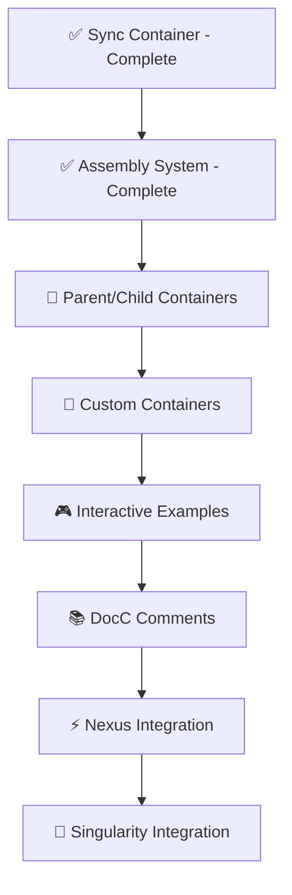

<div align="center">
  
</div>

<br>

<div align="center">
  
[](https://github.com/astro-bytes/astroject/releases)
[](https://opensource.org/licenses/MIT)
[](https://swift.org)
[](https://developer.apple.com/ios/)
[](https://developer.apple.com/macos/)
[](https://developer.apple.com/tvos/)
[](https://developer.apple.com/watchos/)
[](https://developer.apple.com/visionos/)
<!-- [](https://github.com/astro-bytes/astroject/actions/workflows/swift-unit-test.yml)
[](https://github.com/astro-bytes/astroject/actions/workflows/swiftlint.yml)
-->

</div>

---

Astroject is a modern, lightweight, and robust dependency injection (DI) framework designed for Swift applications across all platforms. It simplifies the management of object dependencies, promoting cleaner, more modular, and testable code. With a focus on thread safety and intuitive APIs, Astroject empowers developers to build complex applications with confidence. 

## ✨ Features
Astroject comes packed with features to streamline your dependency management:

- **Flexible Registration & Resolution:**  Register and resolve dependencies with or without arguments, supporting both synchronous and asynchronous (async/await) factory methods.
- **Comprehensive Instance Scoping:** Control the lifecycle of your objects with built-in instance scopes:
  - ***Singleton:*** Ensures a single, shared instance throughout the container's lifetime that is not disposable.
  - ***Disposable Singleton:*** Ensures a single, shared instance throughout the container's lifetime that is disposable.
  - ***Weak:*** Holds a weak reference to the instance, allowing it to be deallocated when no longer strongly referenced.
  - ***Transient:*** Creates a new instance every time it's resolved.
  - ***Graph:*** Manages instances within a specific resolution graph, ideal for scoped lifecycles like a request or a feature flow.
- **Robust Error Handling:** Clear and informative runtime errors, including:
  - ***Circular Dependency Detection:*** Prevents infinite loops during resolution.
  - ***Registration Overrides:*** Strict control over whether existing registrations can be replaced.
  - ***No Registration Found:*** Alerts when a requested dependency isn't registered.
  - ***Invalid Instance Settings:*** Catches misconfigurations at build and runtime.
  - ***Registration Overriding:*** Provides fine-grained control over whether an existing registration can be overridden by a new one. You can explicitly protect critical instances from accidental replacement, ensuring predictable behavior in your application.
- **Thread Safety by Design:** Astroject's core mechanisms are built with concurrency in mind, using serial queues to ensure safe access to registrations and resolution graphs from multiple threads.
- **Extensible Behaviors & Hooks:** Add custom logic and cross-cutting concerns to your DI process through behaviors that can observe and react to registration events.
- **Modular Assemblies:** Organize your registrations into reusable `Assembly` modules. These can be combined in a master `Assembler` to cleanly inject dependencies into your `Container`. Assemblies also offer pre- and post-assembly hooks for custom setup or teardown.

## 🚀 Getting Started
### 📦 Installation
Astroject is currently available via Swift Package Manager.

#### For Xcode Projects:

In Xcode, open your project.
Navigate to File > Add Packages...
Enter the repository URL: https://github.com/astro-bytes/Astroject
Select the desired version (e.g., Up to Next Major Version 1.0.0).

#### For Swift Packages:

Add Astroject as a dependency in your Package.swift file:
```Swift
// swift-tools-version:5.7
import PackageDescription

let package = Package(
    name: "YourPackageName",
    dependencies: [
        // other dependencies
        .package(url: "https://github.com/astro-bytes/Astroject", from: "1.0.0")
    ],
    targets: [
        .target(
            name: "YourTargetName",
            dependencies: ["Astroject"]),
        // other targets
    ]
)
```
### 🛠️ Basic Usage

Let's see Astroject in action with some simple examples:

### Module Organization

Astroject is organized into several modules for flexibility:

- **AstrojectCore**: Core protocols and types (Container, Assembly, Registrable, etc.)
- **AstrojectAsync**: AsyncContainer implementation for async/await workflows
- **AstrojectSync**: SyncContainer implementation for synchronous workflows

Import the modules you need:

```swift
import AstrojectCore  // Always needed for Assembly, Container protocols
import AstrojectAsync // When using AsyncContainer
import AstrojectSync  // When using SyncContainer
```

#### 1.0 Define your dependencies and services
```Swift
import Astroject
import Foundation // For UUID and basic types

protocol Dependency {
    var value: String { get }
}

class ConcreteDependency: Dependency {
    let value: String = "I'm a concrete dependency!"
}

class ViewModel {
    let dependency: Dependency
    init(_ dependency: Dependency) {
        self.dependency = dependency
        print("ViewModel initialized with: \(dependency.value)")
    }
}

class ViewModel2 {
    let dependency: Dependency
    init(_ dependency: Dependency) {
        self.dependency = dependency
        print("ViewModel2 initialized with: \(dependency.value)")
    }
}

class ViewModel3 {
    let dependency: Dependency
    let identifier: String
    init(_ dependency: Dependency, _ identifier: String) {
        self.dependency = dependency
        self.identifier = identifier
        print("ViewModel3 initialized with: \(dependency.value) and identifier: \(identifier)")
    }
}

class ClassObject {
    init() { print("ClassObject initialized") }
}

class WeakObject {
    init() { print("WeakObject initialized") }
    deinit { print("WeakObject deinitialized") }
}
```
#### 2.0 Create a Container instance

Choose between async and sync containers based on your needs:

```Swift
import AstrojectAsync

// For async/await based resolution
let asyncContainer = AsyncContainer()

// Or use SyncContainer for synchronous resolution
import AstrojectSync
let syncContainer = SyncContainer()
```

For the following examples, we'll use AsyncContainer:

```Swift
let container = AsyncContainer()
```

You can also optionally create a container with an assembler attached:

```Swift
// Create container with an empty assembler
let containerWithAssembler = AsyncContainer(createAssembler: true)

// Create container with assemblies (assembler is automatically created and populated)
let containerWithAssemblies = try AsyncContainer(assemblies: [
    NetworkingAssembly(),
    FeatureAssembly()
])

// Access the assembler from the container
if let assembler = containerWithAssembler.assembler {
    // Add more assemblies and assemble
    try assembler
        .add(assembly: AnotherAssembly())
        .assemble()
}
```

#### 3.0 Register your dependencies
```Swift
// Register a simple Int value
try container.register(Int.self) { 42 }

// Register a concrete dependency (sync factory)
try container.register(Dependency.self) {
    ConcreteDependency()
}

// Register a ViewModel that resolves a dependency (async factory example)
// Assuming Dependency.self can be resolved asynchronously if needed in a real scenario
try container.register(ViewModel.self) { resolver in
    let dependency = try await resolver.resolve(Dependency.self)
    return ViewModel(dependency)
}

// Register a ViewModel with a specific name for differentiation
try container.register(ViewModel2.self, name: "SpecialCaseViewModel") { resolver in
    let dependency = try await resolver.resolve(Dependency.self)
    return ViewModel2(dependency)
}

// Register a ViewModel that requires an argument during resolution
try container.register(ViewModel3.self, argument: String.self) { resolver, arg in
    let dependency = try await resolver.resolve(Dependency.self)
    return ViewModel3(dependency, arg)
}
```

#### 3.1 Explore Instance Scopes
```Swift
// Register a String as transient (new instance every time)
try container.register(String.self) {
    "Hello World from \(UUID().uuidString)"
}.asTransient()

// Register a ClassObject as a singleton (single instance shared)
try container.register(ClassObject.self) {
    ClassObject()
}.asSingleton()

// Register a WeakObject with a weak reference (deallocated when no strong references remain)
try container.register(WeakObject.self) {
    WeakObject()
}.asWeak()
```

#### 4.0 Resolve your dependencies
```Swift
// Resolve the simple Int
let intValue = try await container.resolve(Int.self)
print("Resolved Int: \(intValue)") // Output: Resolved Int: 42

// Resolve the ViewModel
let viewModel = try await container.resolve(ViewModel.self)
print("ViewModel's dependency value: \(viewModel.dependency.value)")

// Resolve the named ViewModel
let specialViewModel = try await container.resolve(ViewModel2.self, name: "SpecialCaseViewModel")
print("Special ViewModel's dependency value: \(specialViewModel.dependency.value)")

// Resolve the ViewModel with an argument
let viewModelWithArg = try await container.resolve(ViewModel3.self, argument: "CustomArg123")
print("ViewModel with Arg's identifier: \(viewModelWithArg.identifier)")

// Demonstrate Transient scope
let firstString = try await container.resolve(String.self)
let secondString = try await container.resolve(String.self)
print("Transient Strings - First: \"\(firstString)\", Second: \"\(secondString)\"")
print("Are transient strings the same instance? \(firstString == secondString ? "Yes" : "No")") // Should be No

// Demonstrate Singleton scope
let firstClassObject = try await container.resolve(ClassObject.self)
let secondClassObject = try await container.resolve(ClassObject.self)
print("Are singleton ClassObjects the same instance? \(firstClassObject === secondClassObject ? "Yes" : "No")") // Should be Yes

// Demonstrate Weak scope
var weakObject: WeakObject? = try await container.resolve(WeakObject.self)
print("WeakObject resolved: \(String(describing: weakObject))")
weakObject = nil // Release strong reference
// At this point, "WeakObject deinitialized" might print if no other strong references exist.
print("WeakObject after setting to nil: \(String(describing: weakObject))")
```

## 📚 Core Concepts
Astroject's design revolves around a few fundamental components, working together to provide a powerful dependency injection experience:

- **Container:** The central hub of Astroject. The Container is responsible for managing all registrations and resolving dependencies. It ensures thread-safe operations and maintains the in-flight resolution graph, handling object lifecycles and behaviors as expected. It's the ultimate holder for all your registered factories and instances.
- **Registrable:** This protocol defines anything that can be registered with the Container. A Registrable encapsulates the factory method used to create an object, its instance management scope, and any post-initialization actions. It's the blueprint the Container references to understand how to provide an object instance based on the requested scope. Astroject's extensibility allows you to define custom Registrable types.
- **Instance:** Defines the lifecycle management strategy (scope) for a registered product. Implementations of this protocol (like Singleton, Weak, Transient, Graph) dictate how an object's instance is controlled and maintained. You can extend Astroject with your own custom scopes by conforming to the Instance protocol and using the .as() method during registration.
- **Context:** Represents the current resolution context within the dependency graph. Primarily used for Graph instance management, the Context helps track the depth of resolution and provides a unique graphID for instances resolved within a specific resolution tree. It remains consistent throughout a single resolution tree, adapting for nested resolutions.

---
### 🔏 Controlling Registration Overrides

Astroject embraces flexibility by naturally supporting registration overriding. This means that if you register a type multiple times under the same key (same type and optional name), the latest registration will automatically take precedence. This powerful default behavior is incredibly useful for scenarios like:

- **Testing:** Easily inject mock or stub implementations during unit or integration tests without altering your core application code.
- **Feature Flags:** Dynamically swap out implementations based on runtime configurations or feature flags.
- **Development vs. Production:** Provide different service implementations for different environments.

#### Example: Default Overriding Behavior

In this example, we register Int.self twice. The second registration will silently replace the first:

```Swift
let container = Container()

// First registration: Int will return 42
try container.register(Int.self) {  42 }
print("Initial Int value (should be 42): \(try await container.resolve(Int.self))") // Output: Initial Int value (should be 42): 42

// Second registration for the same type: Int now returns 99
try container.register(Int.self) {  99 }
print("Overridden Int value (should be 99): \(try await container.resolve(Int.self))") // Output: Overridden Int value (should be 99): 99
```
#### Protecting Registrations

While overriding is powerful, there are times you need to enforce a single, definitive registration for a given type. Astroject provides a simple way to prevent accidental overrides by marking a registration as non-overridable.

Simply set isOverridable to false during registration:

```Swift
let container = Container()

// This registration is explicitly marked as non-overridable
try container.register(Int.self, isOverridable: false) {  42 }
print("Protected Int value: \(try await container.resolve(Int.self))") // Output: Protected Int value: 42

// Attempting to register another Int will now throw an error
do {
    try container.register(Int.self) {  99 }
    print("This line will not be reached.")
} catch AstrojectError.alreadyRegistered(let type, let name) {
    print("Error: Registration for \(type) with name \(name ?? "nil") already exists and cannot be overridden.")
    // Output: Error: Registration for Int already exists and cannot be overridden.
} catch {
    print("An unexpected error occurred: \(error)")
}
```
*This granular control empowers you, the developer, to manage your dependency graph with precision, preventing unintended changes to critical components.*


### 🔭 Extending Instance Scopes

Astroject is designed for flexibility, allowing you to define and use your own custom instance management scopes. This is achieved by conforming to the Instance protocol and integrating your custom scope via the `.as()` function on any Registrable.

#### Creating a Custom Instance:

Simply create a class or struct that conforms to the Instance protocol:

```Swift
import Astroject
import Foundation // For UUID in example

class ExampleInstance: Instance {
    typealias Product = Any // Or a specific type if this instance only handles that type

    // A simple in-memory cache for demonstration
    private var storedProduct: Product?

    func get(for context: Context) -> Product? {
        // Implement your custom retrieval logic
        return storedProduct
    }

    func set(_ product: Product, for context: Context) {
        // Implement your custom storage logic
        self.storedProduct = product
    }

    func release(for context: Context?) {
        // Implement your custom release logic
        if context == nil {
            storedProduct = nil // Release all if context is nil
        }
        // For a specific context, you might remove only that instance if you manage multiple
    }
}
```

#### Using Your Custom Instance:

Once defined, you can use your custom instance during registration:

```Swift
let container = Container()
try container.register(Int.self) { 42 }.as(ExampleInstance())

let value = try await container.resolve(Int.self)
print("Resolved Int with ExampleInstance: \(value)") // Output: Resolved Int with ExampleInstance: 42
```

#### Creating Convenience Methods:

For frequently used custom scopes, you can create convenience functions by extending Registrable, making your registration code cleaner and more readable:

```Swift
extension Registrable {
    @discardableResult
    func asExample() -> Self { // Renamed to 'asExample' for clarity and consistency with other 'as' methods
        self.as(ExampleInstance())
    }
}

// Now you can register like this:
try container.register(String.self) { "Hello from custom scope" }.asExample()
let customScopedString = try await container.resolve(String.self)
print("Resolved String with asExample: \(customScopedString)")
```

### ⚙️ Behaviors

Astroject's Behaviors provide a powerful mechanism to inject additional functionality or cross-cutting concerns into your container's lifecycle. Behaviors are applied to each registration as they occur, allowing you to react to events like a new type being registered. This is incredibly useful for logging, analytics, debugging, or custom validation during the setup phase of your dependency graph.

To create a custom behavior, simply conform to the Behavior protocol and implement its methods (currently, didRegister is available).

#### Example: A Simple Logging Behavior

This example demonstrates a basic LoggingBehavior that prints a message every time a new type is registered with the container.

```Swift
import Astroject

class LoggingBehavior: Behavior {
    func didRegister<Product>(
        type: Product.Type,
        to container: Container,
        as registration: any Registrable<Product>,
        with name: String?
    ) {
        print("Astroject: Registered \(type) with name: '\(name ?? "nil")'")
    }
}

let container = Container()
container.add(LoggingBehavior()) // Add the behavior to the container

// When you register something, the behavior's didRegister method will be called:
try container.register(Int.self, name: "answer") {  42 }
// Output: Astroject: Registered Int with name: 'answer'

try container.register(String.self) { "Hello, Astroject!" }
// Output: Astroject: Registered String with name: 'nil'
```
*By adding custom behaviors, you can easily extend Astroject's functionality to suit your application's specific needs without modifying the core framework.*

# 🏗️ Assemblies and Assembler

For larger applications, registering all dependencies in one place quickly becomes unmanageable.
Astroject addresses this by introducing Assemblies and the Assembler, enabling a modular, explicit, and testable dependency graph.

---

## Assemblies

An Assembly is a unit of configuration responsible for registering a related set of dependencies into a Container.

Assemblies:
- Encapsulate dependency registration logic
- May declare dependencies on other assemblies
- May participate in lifecycle hooks
- Are executed and coordinated by an Assembler

Assemblies themselves do not perform registration until applied by an Assembler.

---

## Using Assemblies with AsyncContainer and SyncContainer

Astroject provides two specialized container implementations that fully support the Assembly system:

- **AsyncContainer**: For async/await based dependency resolution
- **SyncContainer**: For synchronous dependency resolution

Both containers work seamlessly with the Assembler to organize and apply your dependency configurations.

### Container-Managed Assemblers

Both `AsyncContainer` and `SyncContainer` can optionally manage their own assembler instance. This provides a convenient way to handle assembly directly through the container:

```swift
import AstrojectAsync

// Create a container with an automatically managed assembler
let container = AsyncContainer(createAssembler: true)

// Add and assemble through the container's assembler
try container.assembler?
    .add(assembly: NetworkingAssembly())
    .add(assembly: FeatureAssembly())
    .assemble()

// Resolve directly from the container
let service = try await container.resolve(MyService.self)
```

This approach is useful when you want the container to manage the assembler lifecycle and keep everything in one place.

### Quick Start with Containers

#### Using AsyncContainer

```swift
import AstrojectAsync

// Create an assembler with an async container
let assembler = Assembler(AsyncContainer())

try assembler
    .add(assembly: NetworkingAssembly())
    .add(assembly: FeatureAssembly())
    .assemble()

// Resolve dependencies asynchronously
let service = try await assembler.resolver.resolve(MyService.self)
```

#### Using SyncContainer

```swift
import AstrojectSync

// Create an assembler with a sync container
let assembler = Assembler(SyncContainer())

try assembler
    .add(assembly: CoreAssembly())
    .add(assembly: UIAssembly())
    .assemble()

// Resolve dependencies synchronously
let viewModel = try assembler.resolver.resolve(MyViewModel.self)
```

### Initialize Container with Assemblies

You can create a container and immediately assemble it with assemblies:

```swift
import AstrojectAsync

// Create container and automatically assemble all provided assemblies
let container = try AsyncContainer(assemblies: [
    DatabaseAssembly(),
    NetworkingAssembly(),
    FeatureAssembly()
])

// The assembler is already created and assembled
if let assembler = container.assembler {
    #expect(assembler.isAssembled)
}

// Resolve directly from container
let service = try await container.resolve(MyService.self)
```

### Container-First Approach

You can also create containers directly and apply assemblies to them:

```swift
import AstrojectAsync

// Create the container first
let container = AsyncContainer()

// Create assembler with the container
let assembler = Assembler(container: container)

try assembler
    .add(assemblies: [
        DatabaseAssembly(),
        NetworkingAssembly(),
        RepositoryAssembly()
    ])
    .assemble()

// Use the container directly
let repository = try await container.resolve(UserRepository.self)
```

### Choosing Between AsyncContainer and SyncContainer

**Use AsyncContainer when:**
- Your dependencies involve async operations (network calls, database queries)
- You're building an async/await-first application
- You need to resolve dependencies in async contexts

**Use SyncContainer when:**
- All your dependencies can be created synchronously
- You're working with legacy code or synchronous APIs
- You need immediate, blocking dependency resolution

Both containers support the full Assembly lifecycle and all dependency management features.

---

## Assembly Lifecycle

Assemblies participate in a structured lifecycle when applied by an Assembler.

### Lifecycle Execution Order

For each assembly, lifecycle methods are executed in the following order:

1. preassemble()
2. preloaded() (deprecated, still executed)
3. assemble(container:)
4. postAssemble(resolver:)
5. loaded(resolver:) (deprecated, still executed)

All assemblies complete steps 1–3 for every assembly before any assembly enters steps 4–5.

---

### `preassemble()`

Called before any dependency registration occurs.

Use this hook for:
- Validation
- Configuration checks
- Preparing state required for registration

```swift
func preassemble() throws
```

- Optional
- Default implementation does nothing

---

### `assemble(container:)`

The core lifecycle method where dependencies are registered into the container.

```swift
func assemble(container: Container) throws
```

- Required
- All dependency registrations must occur here

---

### `postAssemble(resolver:)`

Called after all assemblies have completed registration.

Use this hook for:
- Resolving initial instances
- Cross-assembly validation
- Post-registration wiring

```swift
func postAssemble(resolver: Resolver) throws
```

- Optional
- Default implementation does nothing

---

## Legacy Lifecycle Hooks

Astroject maintains backward compatibility with legacy lifecycle hooks.

| Legacy Hook         | Modern Replacement      |
|---------------------|-------------------------|
| preloaded()         | preassemble()           |
| loaded(resolver:)   | postAssemble(resolver:) |

These hooks are deprecated but still executed to avoid breaking existing assemblies.

---

## Declaring Assembly Dependencies

Assemblies may declare dependencies on other assemblies.

```swift
static var requiredAssemblies: [Assembly.Type] { get }
```

- Default implementation returns an empty array
- Dependencies are validated before assembly begins
- Missing required assemblies cause assembly to fail or they can be generated
  automatically (default behavior)

Example:
```swift
struct FeatureAssembly: Assembly {

    static var requiredAssemblies: [Assembly.Type] {
        [CoreAssembly.self, NetworkingAssembly.self]
    }

    func assemble(container: Container) throws {
        try container.register(String.self, name: "featureName") {
            "My Feature"
        }
    }
}
```

---

## Automatic Initialization of Missing Assemblies

The `Assembler` provides a property called `initializeMissingAssemblies` that controls
how missing required assemblies are handled during `assemble()`.

### Behavior

- `true` (default)  
  Missing required assemblies are automatically instantiated and added to the assembler
  before assembly proceeds. This allows the assembler to satisfy all declared dependencies
  without requiring the user to manually add every assembly.

- `false`  
  Missing required assemblies will cause `assemble()` to throw 
  `Assembler.Error.missingRequiredAssemblies`. This enforces strict manual registration
  and allows you to catch configuration issues early.

### Usage Example

Automatic initialization (default):

    let assembler = try Assembler(
        container: container,
        assemblies: [FeatureAssembly()],
        initializeMissingAssemblies: true
    )
    // Any required assemblies not present will be created automatically

Strict validation:

    let assembler = try Assembler(
        container: container,
        assemblies: [FeatureAssembly()],
        initializeMissingAssemblies: false
    )
    // Throws Error.missingRequiredAssemblies if any required assemblies are missing

### Notes

- This behavior only applies to assemblies declared in `requiredAssemblies`.
- Automatically initialized assemblies will go through the normal assembly lifecycle
  (`preassemble()`, `assemble(container:)`, `postAssemble(resolver:)`).
- Use `initializeMissingAssemblies = false` in production if you want explicit control
  over all assemblies added to the container.

---

## Assembler

The Assembler coordinates applying one or more assemblies to a Container.

Responsibilities:
- Validates required assemblies
- Executes the full assembly lifecycle
- Prevents duplicate assembly runs
- Provides a fluent API for composition

---

## Creating an Assembler

### Fluent / Manual Assembly

```swift
let assembler = Assembler(container: container)

try assembler
    .add(assembly: CoreAssembly())
    .add(assemblies: [FeatureAssembly(), AnalyticsAssembly()])
    .assemble()
```

Behavior:
- Adding assemblies marks the assembler as needing assembly
- assemble() validates dependencies and executes all lifecycle hooks
- Calling assemble() more than once throws an error

---

### Automatic Assembly via Initializer
```swift
let assembler = try Assembler(
    container: container,
    assemblies: [
        CoreAssembly(),
        NetworkingAssembly(),
        FeatureAssembly()
    ]
)
```

Behavior:
- Assemblies are validated immediately
- Lifecycle hooks are executed automatically
- No additional assemble() call is required

---

## Assembly Rules

- Assemblies execute in the order they are added
- When `initializeMissingAssemblies` is enabled, any missing assemblies are automatically added in dependency order before their dependents
- All required assemblies must be present
- Assemblies are assembled only once per assembler
- Legacy lifecycle hooks are executed automatically

---

## Example

```swift
class MyAssembly: Assembly {

    required init() {}

    func preassemble() {
        print("Preparing MyAssembly")
    }

    func assemble(container: Container) throws {
        try container.register(String.self, name: "greeting") {
            "Hello from Astroject!"
        }
    }

    func postAssemble(resolver: Resolver) throws {
        let greeting: String = try resolver.resolve(String.self, name: "greeting")
        print(greeting)
    }
}

let container = Container()
let assembler = Assembler(container: container)

try assembler
    .add(assembly: MyAssembly())
    .assemble()
```

---

## Complete Example: Building a Feature with Assemblies

Here's a complete example showing how to structure a feature using assemblies with both async and sync containers:

### Define Your Services

```swift
// Domain models and protocols
protocol NetworkService {
    func fetch(url: String) async throws -> Data
}

protocol UserRepository {
    func getUser(id: String) async throws -> User
}

class User {
    let id: String
    let name: String
    init(id: String, name: String) {
        self.id = id
        self.name = name
    }
}

// Implementations
class URLNetworkService: NetworkService {
    func fetch(url: String) async throws -> Data {
        // Implementation here
        return Data()
    }
}

class RemoteUserRepository: UserRepository {
    let networkService: NetworkService
    
    init(networkService: NetworkService) {
        self.networkService = networkService
    }
    
    func getUser(id: String) async throws -> User {
        let data = try await networkService.fetch(url: "https://api.example.com/users/\(id)")
        // Parse and return user
        return User(id: id, name: "John Doe")
    }
}

class UserViewModel {
    let repository: UserRepository
    
    init(repository: UserRepository) {
        self.repository = repository
    }
    
    func loadUser(id: String) async throws -> User {
        try await repository.getUser(id: id)
    }
}
```

### Create Assemblies

```swift
import AstrojectCore
import AstrojectAsync

// Networking layer assembly
struct NetworkingAssembly: Assembly {
    func assemble(container: Container) throws {
        try container.register(NetworkService.self) {
            URLNetworkService()
        }.asSingleton()
    }
}

// Repository layer assembly
struct RepositoryAssembly: Assembly {
    static var requiredAssemblies: [Assembly.Type] {
        [NetworkingAssembly.self]
    }
    
    func assemble(container: Container) throws {
        try container.register(UserRepository.self) { resolver in
            let networkService = try await resolver.resolve(NetworkService.self)
            return RemoteUserRepository(networkService: networkService)
        }.asSingleton()
    }
}

// Presentation layer assembly
struct PresentationAssembly: Assembly {
    static var requiredAssemblies: [Assembly.Type] {
        [RepositoryAssembly.self]
    }
    
    func assemble(container: Container) throws {
        try container.register(UserViewModel.self) { resolver in
            let repository = try await resolver.resolve(UserRepository.self)
            return UserViewModel(repository: repository)
        }
    }
}
```

### Wire It All Together

```swift
import AstrojectAsync

// Approach 1: Fluent API with AsyncContainer
let assembler = Assembler(AsyncContainer())

try assembler
    .add(assembly: PresentationAssembly())
    .assemble()

// All required assemblies are automatically initialized!
// NetworkingAssembly and RepositoryAssembly were added automatically

// Use your dependencies
let viewModel = try await assembler.resolver.resolve(UserViewModel.self)
let user = try await viewModel.loadUser(id: "123")
print("Loaded user: \(user.name)")

// Approach 2: Direct container initialization
let container = AsyncContainer()
let assembler2 = Assembler(container: container)

try assembler2
    .add(assemblies: [
        NetworkingAssembly(),
        RepositoryAssembly(),
        PresentationAssembly()
    ])
    .assemble()

// Use the container directly
let anotherViewModel = try await container.resolve(UserViewModel.self)
```

### Synchronous Version

For synchronous-only dependencies, use SyncContainer:

```swift
import AstrojectSync

// Define synchronous services
protocol ConfigService {
    var apiKey: String { get }
}

class AppConfigService: ConfigService {
    let apiKey: String = "your-api-key"
}

// Create assembly
struct ConfigAssembly: Assembly {
    func assemble(container: Container) throws {
        try container.register(ConfigService.self) {
            AppConfigService()
        }.asSingleton()
    }
}

// Use SyncContainer
let syncAssembler = Assembler(SyncContainer())

try syncAssembler
    .add(assembly: ConfigAssembly())
    .assemble()

// Resolve synchronously
let config = try syncAssembler.resolver.resolve(ConfigService.self)
print("API Key: \(config.apiKey)")
```

---

## Key Takeaways

- Assemblies are modular and self-contained
- Assembly dependencies are explicit and validated
- A three-phase lifecycle with legacy compatibility
- Assemblers guarantee safe, single-pass assembly
- Supports both fluent and automatic assembly styles

---

## Best Practices for Using Assemblies

### 1. **Organize by Layer or Feature**

Structure your assemblies around architectural layers or features:

```swift
// Layer-based
struct DataLayerAssembly: Assembly { }
struct DomainLayerAssembly: Assembly { }
struct PresentationLayerAssembly: Assembly { }

// Feature-based
struct UserManagementAssembly: Assembly { }
struct AuthenticationAssembly: Assembly { }
struct AnalyticsAssembly: Assembly { }
```

### 2. **Declare Dependencies Explicitly**

Always declare required assemblies to ensure proper initialization order:

```swift
struct FeatureAssembly: Assembly {
    static var requiredAssemblies: [Assembly.Type] {
        [CoreAssembly.self, NetworkingAssembly.self]
    }
    
    func assemble(container: Container) throws {
        // Your registrations here
    }
}
```

### 3. **Choose the Right Container**

- Use `AsyncContainer` for modern async/await workflows
- Use `SyncContainer` for legacy code or purely synchronous operations
- Both support the full assembly system

### 4. **Keep Assemblies Focused**

Each assembly should have a single responsibility:

```swift
// Good ✅
struct DatabaseAssembly: Assembly {
    func assemble(container: Container) throws {
        try container.register(Database.self) { /* ... */ }
        try container.register(DatabaseMigrator.self) { /* ... */ }
    }
}

// Avoid ❌
struct EverythingAssembly: Assembly {
    func assemble(container: Container) throws {
        // Registering database, networking, UI, analytics, etc.
        // Too many responsibilities!
    }
}
```

### 5. **Use Lifecycle Hooks Appropriately**

- `preassemble()`: For validation and setup
- `assemble(container:)`: For dependency registration
- `postAssemble(resolver:)`: For resolving and wiring dependencies

```swift
struct ValidatedAssembly: Assembly {
    func preassemble() throws {
        // Validate configuration before registration
        guard isConfigurationValid() else {
            throw AssemblyError.invalidConfiguration
        }
    }
    
    func assemble(container: Container) throws {
        // Register dependencies
    }
    
    func postAssemble(resolver: Resolver) throws {
        // Resolve and initialize eager singletons
        _ = try await resolver.resolve(DatabaseMigrator.self)
    }
}
```

### 6. **Test Your Assemblies**

Assemblies are testable units of configuration:

```swift
import Testing
@testable import YourApp

@Test func testUserAssembly() throws {
    let container = AsyncContainer()
    let assembler = Assembler(container: container)
    
    try assembler.add(assembly: UserAssembly()).assemble()
    
    // Verify registrations
    #expect(container.isRegistered(UserService.self))
    #expect(container.isRegistered(UserRepository.self))
    
    // Verify resolution
    let service = try await container.resolve(UserService.self)
    #expect(service != nil)
}
```

## 💡 Sample Code
Checkout our sample code under the [playgrounds](/Playgrounds) directory. (Coming Soon!)

## 🚧 Roadmap
Astroject is continually evolving! Here are some exciting features planned for the future:

- **✅ Sync Container:** Support for a non async/await version of the container with all the same flexibility as the async/await container. (Completed!)
- **✅ Assembly System:** Modular dependency configuration with lifecycle hooks and automatic dependency resolution. (Completed!)
- **Parent/Child Container Relationships:** Support for hierarchical containers, allowing for more granular scope management and overriding.
- **Custom Containers:** Support for building custom container objects that can be used in tandem with other public components/protocols.
- **Interactive Code Examples:** Swift Playgrounds will be created to provide hands-on, executable examples of Astroject's features.
- **Comprehensive DocC Comments:** Full, detailed documentation for all public APIs will be provided.
- **Nexus Integration:** A new sub-library, Nexus, is planned to introduce automatic registration of objects, significantly reducing boilerplate. (Completion date TBD)
- **Singularity Integration:** Another upcoming sub-library, Singularity, will enable registration of objects directly from resource files. (Completion date TBD)
 

```mermaid
graph TD
    A[✅ Sync Container - Complete]
    B[✅ Assembly System - Complete]
    C[🧬 Parent/Child Containers]
    D[🧱 Custom Containers]
    E[🎮 Interactive Examples]
    F[📚 DocC Comments]
    G[⚡ Nexus Integration]
    H[🧾 Singularity Integration]

    A --> B --> C --> D --> E --> F --> G --> H
```

## 👋🏼 Contributing
We welcome contributions from the community! If you'd like to contribute to Astroject, please refer to our detailed [contributing guidelines](CONTRIBUTING.md).

## 🙏🏼 Credits
Astroject was inspired by 
- [Swinject](https://github.com/Swinject/Swinject).
- [SwinjectAutoRegistration](https://github.com/Swinject/SwinjectAutoregistration)
- [SwinjectPropertyLoader](https://github.com/Swinject/SwinjectPropertyLoader)

## 📄 License
Astroject is released under the MIT License. See [LICENSE](LICENSE) for details.
