<div align="center">
  
</div>

<br>

<div align="center">
  
[](https://github.com/astro-bytes/astroject/releases)
[](https://opensource.org/licenses/MIT)
[](https://swift.org)
[](https://developer.apple.com/ios/)
[](https://developer.apple.com/macos/)
[](https://developer.apple.com/tvos/)
[](https://developer.apple.com/watchos/)
[](https://developer.apple.com/visionos/)
[](https://github.com/astro-bytes/astroject/actions/workflows/swift-unit-test.yml)
[](https://github.com/astro-bytes/astroject/actions/workflows/swiftlint.yml)

</div>

---

Astroject is a modern, lightweight, and robust dependency injection (DI) framework designed for Swift applications across all platforms. It simplifies the management of object dependencies, promoting cleaner, more modular, and testable code. With a focus on thread safety and intuitive APIs, Astroject empowers developers to build complex applications with confidence. 

## ✨ Features
Astroject comes packed with features to streamline your dependency management:

- **Flexible Registration & Resolution:**  Register and resolve dependencies with or without arguments, supporting both synchronous and asynchronous (async/await) factory methods.
- **Comprehensive Instance Scoping:** Control the lifecycle of your objects with built-in instance scopes:
  - ***Singleton:*** Ensures a single, shared instance throughout the container's lifetime.
  - ***Weak:*** Holds a weak reference to the instance, allowing it to be deallocated when no longer strongly referenced.
  - ***Transient:*** Creates a new instance every time it's resolved.
  - ***Graph:*** Manages instances within a specific resolution graph, ideal for scoped lifecycles like a request or a feature flow.
- **Robust Error Handling:** Clear and informative runtime errors, including:
  - ***Circular Dependency Detection:*** Prevents infinite loops during resolution.
  - ***Registration Overrides:*** Strict control over whether existing registrations can be replaced.
  - ***No Registration Found:*** Alerts when a requested dependency isn't registered.
  - ***Invalid Instance Settings:*** Catches misconfigurations at build and runtime.
  - ***Registration Overriding:*** Provides fine-grained control over whether an existing registration can be overridden by a new one. You can explicitly protect critical instances from accidental replacement, ensuring predictable behavior in your application.
- **Thread Safety by Design:** Astroject's core mechanisms are built with concurrency in mind, using serial queues to ensure safe access to registrations and resolution graphs from multiple threads.
- **Extensible Behaviors & Hooks:** Add custom logic and cross-cutting concerns to your DI process through behaviors that can observe and react to registration events.
- **Modular Assemblies:** Organize your registrations into reusable `Assembly` modules. These can be combined in a master `Assembler` to cleanly inject dependencies into your `Container`. Assemblies also offer pre- and post-assembly hooks for custom setup or teardown.

## 🚀 Getting Started
### 📦 Installation
Astroject is currently available via Swift Package Manager.

#### For Xcode Projects:

In Xcode, open your project.
Navigate to File > Add Packages...
Enter the repository URL: https://github.com/astro-bytes/Astroject
Select the desired version (e.g., Up to Next Major Version 1.0.0).

#### For Swift Packages:

Add Astroject as a dependency in your Package.swift file:
```Swift
// swift-tools-version:5.7
import PackageDescription

let package = Package(
    name: "YourPackageName",
    dependencies: [
        // other dependencies
        .package(url: "https://github.com/astro-bytes/Astroject", from: "1.0.0")
    ],
    targets: [
        .target(
            name: "YourTargetName",
            dependencies: ["Astroject"]),
        // other targets
    ]
)
```
### 🛠️ Basic Usage

Let's see Astroject in action with some simple examples:

#### 1.0 Define your dependencies and services
```Swift
import Astroject
import Foundation // For UUID and basic types

protocol Dependency {
    var value: String { get }
}

class ConcreteDependency: Dependency {
    let value: String = "I'm a concrete dependency!"
}

class ViewModel {
    let dependency: Dependency
    init(_ dependency: Dependency) {
        self.dependency = dependency
        print("ViewModel initialized with: \(dependency.value)")
    }
}

class ViewModel2 {
    let dependency: Dependency
    init(_ dependency: Dependency) {
        self.dependency = dependency
        print("ViewModel2 initialized with: \(dependency.value)")
    }
}

class ViewModel3 {
    let dependency: Dependency
    let identifier: String
    init(_ dependency: Dependency, _ identifier: String) {
        self.dependency = dependency
        self.identifier = identifier
        print("ViewModel3 initialized with: \(dependency.value) and identifier: \(identifier)")
    }
}

class ClassObject {
    init() { print("ClassObject initialized") }
}

class WeakObject {
    init() { print("WeakObject initialized") }
    deinit { print("WeakObject deinitialized") }
}
```
#### 2.0 Create a Container instance
```Swift
let container = Container()
```

#### 3.0 Register your dependencies
```Swift
// Register a simple Int value
try container.register(Int.self) { 42 }

// Register a concrete dependency (sync factory)
try container.register(Dependency.self) {
    ConcreteDependency()
}

// Register a ViewModel that resolves a dependency (async factory example)
// Assuming Dependency.self can be resolved asynchronously if needed in a real scenario
try container.register(ViewModel.self) { resolver in
    let dependency = try await resolver.resolve(Dependency.self)
    return ViewModel(dependency)
}

// Register a ViewModel with a specific name for differentiation
try container.register(ViewModel2.self, name: "SpecialCaseViewModel") { resolver in
    let dependency = try await resolver.resolve(Dependency.self)
    return ViewModel2(dependency)
}

// Register a ViewModel that requires an argument during resolution
try container.register(ViewModel3.self, argument: String.self) { resolver, arg in
    let dependency = try await resolver.resolve(Dependency.self)
    return ViewModel3(dependency, arg)
}
```

#### 3.1 Explore Instance Scopes
```Swift
// Register a String as transient (new instance every time)
try container.register(String.self) {
    "Hello World from \(UUID().uuidString)"
}.asTransient()

// Register a ClassObject as a singleton (single instance shared)
try container.register(ClassObject.self) {
    ClassObject()
}.asSingleton()

// Register a WeakObject with a weak reference (deallocated when no strong references remain)
try container.register(WeakObject.self) {
    WeakObject()
}.asWeak()
```

#### 4.0 Resolve your dependencies
```Swift
// Resolve the simple Int
let intValue = try await container.resolve(Int.self)
print("Resolved Int: \(intValue)") // Output: Resolved Int: 42

// Resolve the ViewModel
let viewModel = try await container.resolve(ViewModel.self)
print("ViewModel's dependency value: \(viewModel.dependency.value)")

// Resolve the named ViewModel
let specialViewModel = try await container.resolve(ViewModel2.self, name: "SpecialCaseViewModel")
print("Special ViewModel's dependency value: \(specialViewModel.dependency.value)")

// Resolve the ViewModel with an argument
let viewModelWithArg = try await container.resolve(ViewModel3.self, argument: "CustomArg123")
print("ViewModel with Arg's identifier: \(viewModelWithArg.identifier)")

// Demonstrate Transient scope
let firstString = try await container.resolve(String.self)
let secondString = try await container.resolve(String.self)
print("Transient Strings - First: \"\(firstString)\", Second: \"\(secondString)\"")
print("Are transient strings the same instance? \(firstString == secondString ? "Yes" : "No")") // Should be No

// Demonstrate Singleton scope
let firstClassObject = try await container.resolve(ClassObject.self)
let secondClassObject = try await container.resolve(ClassObject.self)
print("Are singleton ClassObjects the same instance? \(firstClassObject === secondClassObject ? "Yes" : "No")") // Should be Yes

// Demonstrate Weak scope
var weakObject: WeakObject? = try await container.resolve(WeakObject.self)
print("WeakObject resolved: \(String(describing: weakObject))")
weakObject = nil // Release strong reference
// At this point, "WeakObject deinitialized" might print if no other strong references exist.
print("WeakObject after setting to nil: \(String(describing: weakObject))")
```

## 📚 Core Concepts
Astroject's design revolves around a few fundamental components, working together to provide a powerful dependency injection experience:

- **Container:** The central hub of Astroject. The Container is responsible for managing all registrations and resolving dependencies. It ensures thread-safe operations and maintains the in-flight resolution graph, handling object lifecycles and behaviors as expected. It's the ultimate holder for all your registered factories and instances.
- **Registrable:** This protocol defines anything that can be registered with the Container. A Registrable encapsulates the factory method used to create an object, its instance management scope, and any post-initialization actions. It's the blueprint the Container references to understand how to provide an object instance based on the requested scope. Astroject's extensibility allows you to define custom Registrable types.
- **Instance:** Defines the lifecycle management strategy (scope) for a registered product. Implementations of this protocol (like Singleton, Weak, Transient, Graph) dictate how an object's instance is controlled and maintained. You can extend Astroject with your own custom scopes by conforming to the Instance protocol and using the .as() method during registration.
- **Context:** Represents the current resolution context within the dependency graph. Primarily used for Graph instance management, the Context helps track the depth of resolution and provides a unique graphID for instances resolved within a specific resolution tree. It remains consistent throughout a single resolution tree, adapting for nested resolutions.

---
### 🔏 Controlling Registration Overrides

Astroject embraces flexibility by naturally supporting registration overriding. This means that if you register a type multiple times under the same key (same type and optional name), the latest registration will automatically take precedence. This powerful default behavior is incredibly useful for scenarios like:

- **Testing:** Easily inject mock or stub implementations during unit or integration tests without altering your core application code.
- **Feature Flags:** Dynamically swap out implementations based on runtime configurations or feature flags.
- **Development vs. Production:** Provide different service implementations for different environments.

#### Example: Default Overriding Behavior

In this example, we register Int.self twice. The second registration will silently replace the first:

```Swift
let container = Container()

// First registration: Int will return 42
try container.register(Int.self) {  42 }
print("Initial Int value (should be 42): \(try await container.resolve(Int.self))") // Output: Initial Int value (should be 42): 42

// Second registration for the same type: Int now returns 99
try container.register(Int.self) {  99 }
print("Overridden Int value (should be 99): \(try await container.resolve(Int.self))") // Output: Overridden Int value (should be 99): 99
```
#### Protecting Registrations

While overriding is powerful, there are times you need to enforce a single, definitive registration for a given type. Astroject provides a simple way to prevent accidental overrides by marking a registration as non-overridable.

Simply set isOverridable to false during registration:

```Swift
let container = Container()

// This registration is explicitly marked as non-overridable
try container.register(Int.self, isOverridable: false) {  42 }
print("Protected Int value: \(try await container.resolve(Int.self))") // Output: Protected Int value: 42

// Attempting to register another Int will now throw an error
do {
    try container.register(Int.self) {  99 }
    print("This line will not be reached.")
} catch AstrojectError.alreadyRegistered(let type, let name) {
    print("Error: Registration for \(type) with name \(name ?? "nil") already exists and cannot be overridden.")
    // Output: Error: Registration for Int already exists and cannot be overridden.
} catch {
    print("An unexpected error occurred: \(error)")
}
```
*This granular control empowers you, the developer, to manage your dependency graph with precision, preventing unintended changes to critical components.*


### 🔭 Extending Instance Scopes

Astroject is designed for flexibility, allowing you to define and use your own custom instance management scopes. This is achieved by conforming to the Instance protocol and integrating your custom scope via the `.as()` function on any Registrable.

#### Creating a Custom Instance:

Simply create a class or struct that conforms to the Instance protocol:

```Swift
import Astroject
import Foundation // For UUID in example

class ExampleInstance: Instance {
    typealias Product = Any // Or a specific type if this instance only handles that type

    // A simple in-memory cache for demonstration
    private var storedProduct: Product?

    func get(for context: Context) -> Product? {
        // Implement your custom retrieval logic
        return storedProduct
    }

    func set(_ product: Product, for context: Context) {
        // Implement your custom storage logic
        self.storedProduct = product
    }

    func release(for context: Context?) {
        // Implement your custom release logic
        if context == nil {
            storedProduct = nil // Release all if context is nil
        }
        // For a specific context, you might remove only that instance if you manage multiple
    }
}
```

#### Using Your Custom Instance:

Once defined, you can use your custom instance during registration:

```Swift
let container = Container()
try container.register(Int.self) {  42 }.as(ExampleInstance())

let value = try await container.resolve(Int.self)
print("Resolved Int with ExampleInstance: \(value)") // Output: Resolved Int with ExampleInstance: 42
```

#### Creating Convenience Methods:

For frequently used custom scopes, you can create convenience functions by extending Registrable, making your registration code cleaner and more readable:

```Swift
extension Registrable {
    @discardableResult
    func asExample() -> Self { // Renamed to 'asExample' for clarity and consistency with other 'as' methods
        self.as(ExampleInstance())
    }
}

// Now you can register like this:
try container.register(String.self) { "Hello from custom scope" }.asExample()
let customScopedString = try await container.resolve(String.self)
print("Resolved String with asExample: \(customScopedString)")
```

### ⚙️ Behaviors

Astroject's Behaviors provide a powerful mechanism to inject additional functionality or cross-cutting concerns into your container's lifecycle. Behaviors are applied to each registration as they occur, allowing you to react to events like a new type being registered. This is incredibly useful for logging, analytics, debugging, or custom validation during the setup phase of your dependency graph.

To create a custom behavior, simply conform to the Behavior protocol and implement its methods (currently, didRegister is available).

#### Example: A Simple Logging Behavior

This example demonstrates a basic LoggingBehavior that prints a message every time a new type is registered with the container.

```Swift
import Astroject

class LoggingBehavior: Behavior {
    func didRegister<Product>(
        type: Product.Type,
        to container: Container,
        as registration: any Registrable<Product>,
        with name: String?
    ) {
        print("Astroject: Registered \(type) with name: '\(name ?? "nil")'")
    }
}

let container = Container()
container.add(LoggingBehavior()) // Add the behavior to the container

// When you register something, the behavior's didRegister method will be called:
try container.register(Int.self, name: "answer") {  42 }
// Output: Astroject: Registered Int with name: 'answer'

try container.register(String.self) { "Hello, Astroject!" }
// Output: Astroject: Registered String with name: 'nil'
```
*By adding custom behaviors, you can easily extend Astroject's functionality to suit your application's specific needs without modifying the core framework.*

### 🏗️ Assemblies and Assemblers

For larger applications, managing all registrations in one place can become unwieldy. Astroject addresses this with Assemblies and Assemblers, promoting a modular and organized structure for your dependency graph.

An Assembly is a dedicated module responsible for registering a specific set of dependencies. It provides:

A `assemble(container:)` function where all registrations for that module are defined.
A `loaded(resolver:)` function that acts as a hook, executing after all registrations within that assembly are complete. This is perfect for post-setup logic, validation, or resolving initial instances that depend on the full assembly being in place.
The Assembler is a utility that takes one or more Assemblies and applies their registrations to a Container. This allows you to construct your dependency graph by combining various functional modules.

#### Example: Organizing Registrations with an Assembly

Here's how you can define and use an Assembly to encapsulate related registrations:

```Swift
import Astroject

// 1. Define your Assembly
class MyAssembly: Assembly {
    // This is where you register your dependencies for this module
    func assemble(container: Container) {
        // We use try? here for brevity in example, in real code you'd handle errors
        try? container.register(String.self, name: "greeting") {  "Hello from Astroject Assembly!" }
        try? container.register(Int.self) {  123 }
    }

    // This hook runs AFTER assemble() is called and all registrations are processed
    func loaded(resolver: Resolver) {
        if let message: String = try? resolver.resolve(String.self, name: "greeting") {
            print("MyAssembly loaded and resolved message: \(message)")
        }
        if let number: Int = try? resolver.resolve(Int.self) {
            print("MyAssembly loaded and resolved number: \(number)")
        }
    }
}

// 2. Create your Container and Assembler
let container = Container()
let assembler = Assembler(container: container)

// 3. Apply your assembly to the container
print("Applying MyAssembly...")
assembler.apply(assembly: MyAssembly())
// Expected Output during apply (due to loaded hook):
// MyAssembly loaded and resolved message: Hello from Astroject Assembly!
// MyAssembly loaded and resolved number: 123
print("MyAssembly applied.")

// 4. Resolve dependencies registered by the assembly
let message: String = try await container.resolve(String.self, name: "greeting")
print("Resolved message from container: \(message)") // Output: Resolved message from container: Hello from Astroject Assembly!

let number: Int = try await container.resolve(Int.self)
print("Resolved number from container: \(number)") // Output: Resolved number from container: 123
```
*By leveraging Assemblies and Assemblers, you can significantly improve the organization, maintainability, and testability of your application's dependency setup.*

## 💡 Sample Code
Checkout our sample code under the [playgrounds](/Playgrounds) directory. (Coming Soon!)

## 🚧 Roadmap
Astroject is continually evolving! Here are some exciting features planned for the future:

- **Sync Container:** Support for a non async/await version of the container with all the same flexibility as the current async/await container.
- **Parent/Child Container Relationships:** Support for hierarchical containers, allowing for more granular scope management and overriding.
- **Custom Containers:** Support for building custom container objects that can be used in tandom with other public components/protocols.
- **Interactive Code Examples:** Swift Playgrounds will be created to provide hands-on, executable examples of Astroject's features.
- **Comprehensive DocC Comments:** Full, detailed documentation for all public APIs will be provided.
- **Nexus Integration:** A new sub-library, Nexus, is planned to introduce automatic registration of objects, significantly reducing boilerplate. (Completion date TBD)
- **Singularity Integration:** Another upcoming sub-library, Singularity, will enable registration of objects directly from resource files. (Completion date TBD)

```mermaid
graph TD
    A[🔁 Sync Container]
    B[🧬 Parent/Child Containers]
    C[🧱 Custom Containers]
    D[🎮 Interactive Examples]
    E[📚 DocC Comments]
    F[🧾 Singularity Integration]
    G[⚡ Nexus Integration]

    A --> B --> C --> D --> E --> G --> F
```
 


## 👋🏼 Contributing
We welcome contributions from the community! If you'd like to contribute to Astroject, please refer to our detailed [contributing guidelines](CONTRIBUTING.md).

## 🙏🏼 Credits
Astroject was inspired by 
- [Swinject](https://github.com/Swinject/Swinject).
- [SwinjectAutoRegistration](https://github.com/Swinject/SwinjectAutoregistration)
- [SwinjectPropertyLoader](https://github.com/Swinject/SwinjectPropertyLoader)

## 📄 License
Astroject is released under the MIT License. See [LICENSE](LICENSE) for details.
